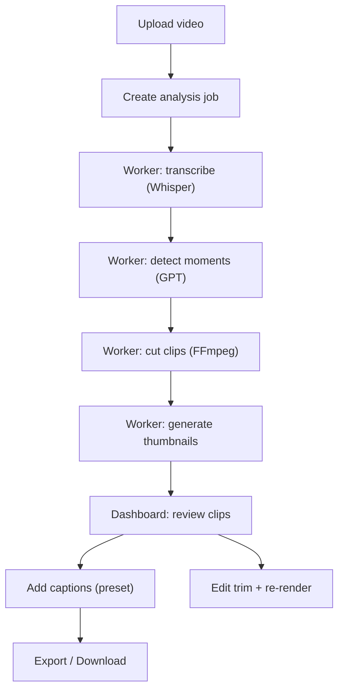

## 1. Product Overview
An AI-powered web app that turns long-form videos into ready-to-post short clips for TikTok, Reels, and YouTube Shorts.
- Solves the pain of manually scrubbing, clipping, captioning, and formatting videos for vertical-first platforms
- Target users: creators, podcasters, marketers, agencies, and social media managers who repurpose long videos into shorts

## 2. Core Features

### 2.1 User Roles
| Role | Registration Method | Core Permissions |
|------|---------------------|------------------|
| MVP User | None (no auth) | Upload video, generate clips, add captions, download exports |

### 2.2 Feature Modules
1. **Upload**: drag-and-drop upload, progress, “Analyzing video…” stepper, analysis trigger
2. **My Clips (Dashboard)**: list clips by video, preview, edit metadata, caption presets, download/export
3. **Clip Editor (Expand Panel)**: view rationale + excerpt, adjust trim times with preview, re-render
4. **Settings**: API/limits info, export defaults, storage path visibility (MVP), theme info

### 2.3 Page Details
| Page Name | Module Name | Feature description |
|-----------|-------------|---------------------|
| Upload | Drag-and-drop upload | Accept MP4/MOV up to 2GB, show file validation errors, show progress bar |
| Upload | Analysis stepper | Animated step list: Transcribing → Detecting moments → Scoring → Generating captions |
| Upload | Job status | Poll job state; display friendly error states and retry action |
| My Clips | Clips grid | Sort by viral_score desc; supports multiple videos; filter by video |
| My Clips | Clip card | Thumbnail, viral score badge, hook strength bar, editable title, duration, editable hashtag chips |
| My Clips | Preview | Inline player modal or inline expand; play original clip and captioned version (if exists) |
| My Clips | Download | One-click download per clip; “Download All” creates zip |
| My Clips | Add captions | Choose preset; starts render job; shows progress; enables preview/download when done |
| Clip Editor | Expandable panel | Show “reason”, transcript excerpt, and editable start/end times with re-trim preview |
| Settings | Export defaults | Default aspect ratio (9:16), default caption preset, output naming template |

## 3. Core Process
Primary user flow:
1. User uploads a long video (MP4/MOV).
2. App stores the file locally and creates a processing job.
3. Worker transcribes audio via Whisper, then asks GPT to propose 5–10 viral segments with timestamps and metadata.
4. Worker cuts each segment into a clip, generates a thumbnail, and stores clip artifacts.
5. User reviews clips in dashboard, edits titles/hashtags, optionally trims a clip.
6. User adds captions using preset styles and exports in desired aspect ratio.

## 4. User Interface Design

### 4.1 Design Style
- Theme: dark, clean, modern; glass-morphism cards on a subtle textured/gradient background
- Primary accent: electric purple (#7C3AED)
- Typography: distinctive display font for headings + legible body font; consistent type scale
- Components: rounded-2xl cards, soft borders, subtle blur, animated skeleton loaders
- Motion: smooth transitions, stepper animations, hover lift on cards, micro-interactions on chips/buttons
- Layout: sidebar navigation (Upload, My Clips, Settings) + content area; mobile collapsible sidebar
- Icon style: simple line icons; avoid noisy iconography

### 4.2 Page Design Overview
| Page Name | Module Name | UI Elements |
|-----------|-------------|-------------|
| Upload | Hero + uploader | Drag area with glow border on hover, file info row, progress bar, helpful limits text |
| Upload | Analysis stepper | Vertical/horizontal stepper with animated dots and state transitions |
| My Clips | Clips grid | Responsive grid, glass cards, score color badges, inline editable fields |
| My Clips | Clip preview | Modal with video player, timeline, and caption preset selector |
| Settings | Preferences | Simple panels, toggles/selects, safe defaults and explanatory text |

### 4.3 Responsiveness
- Desktop-first with mobile optimization
- Mobile: sidebar becomes bottom sheet/drawer; clip cards become 1-column; primary actions remain reachable
- Touch: larger hit targets; avoid hover-only interactions

## 5. Non-Functional Requirements
- Performance: upload progress responsive; dashboard loads fast; serve video assets via static routes
- Reliability: background jobs retriable; partial results visible (clips as they complete)
- Observability: job status and error messages surfaced to UI; server logs include job id (no secrets)
- Security (MVP): validate file type/size, avoid path traversal, rate-limit endpoints, keep OpenAI key server-side only

## 6. MVP Constraints & Stretch Goals
- MVP constraints:
  - Local filesystem storage for uploads/outputs
  - Center-crop for 9:16 auto-reframe
  - No authentication
  - Single-machine Bull worker with Redis
- Stretch goals:
  - Face-aware crop (tracking) for vertical exports
  - Multi-user accounts and persistent libraries
  - S3 storage adapter
  - Timeline editor with waveform and word-level caption preview
