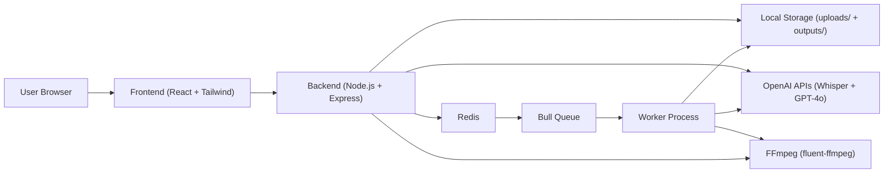
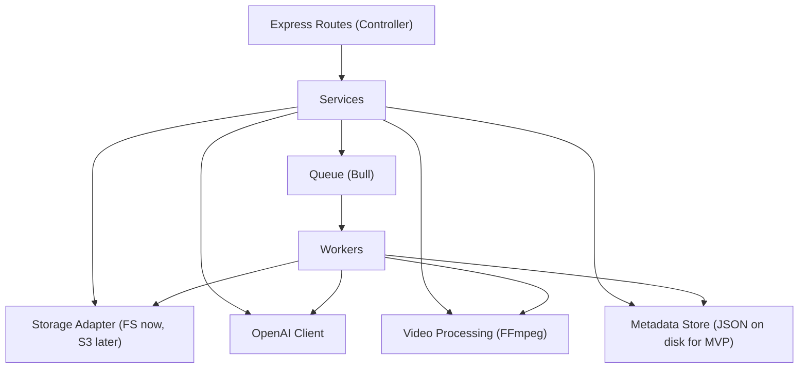
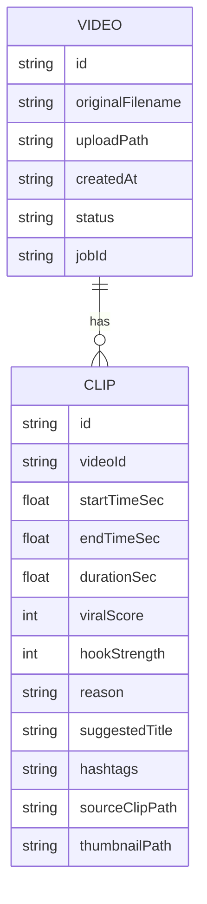

## 1. Architecture Design



## 2. Technology Description
- Frontend: React@18 + Tailwind CSS + Vite
- Backend: Node.js + Express@4
- Queue: Bull + Redis
- Video processing: FFmpeg via fluent-ffmpeg
- AI: OpenAI Whisper (transcription) + GPT-4o (moment detection, scoring, titles, hashtags, caption styling hints)
- Storage: local filesystem (MVP), structured to be swappable for S3 via storage adapter interface
- Packaging: zip creation for “Download All”

## 3. Route Definitions (Frontend)
| Route | Purpose |
|-------|---------|
| /upload | Upload a long video and monitor analysis job status |
| /clips | Dashboard showing clips grouped by uploaded videos |
| /settings | Export defaults and app info |

## 4. API Definitions

### 4.1 REST Endpoints
| Method | Route | Purpose |
|--------|-------|---------|
| POST | /api/upload | Upload a raw video file; returns video id |
| POST | /api/analyze/:id | Enqueue analysis pipeline for uploaded video id |
| GET | /api/jobs/:id | Poll job status and progress steps |
| GET | /api/clips/:videoId | List all clips for a video id |
| POST | /api/clips/:id/captions | Enqueue caption render for a clip id with a style preset |
| GET | /api/clips/:id/download | Download a finished clip artifact |

### 4.2 Type Definitions (TypeScript)
```ts
export type UploadResponse = {
  videoId: string;
  filename: string;
  bytes: number;
};

export type JobStep =
  | "queued"
  | "transcribing"
  | "detecting_moments"
  | "scoring_clips"
  | "cutting_clips"
  | "generating_thumbnails"
  | "ready"
  | "failed";

export type JobStatusResponse = {
  jobId: string;
  state: "waiting" | "active" | "completed" | "failed";
  step: JobStep;
  progress: number; // 0-100
  message?: string;
  error?: string;
  videoId?: string;
};

export type ClipRecord = {
  id: string;
  videoId: string;
  startTimeSec: number;
  endTimeSec: number;
  durationSec: number;
  viralScore: number; // 0-100
  hookStrength: number; // 0-100
  reason: string;
  suggestedTitle: string;
  hashtags: string[];
  transcriptExcerpt?: string;
  paths: {
    sourceClip: string; // file path relative to outputs/
    thumbnail: string; // file path relative to outputs/
    captioned?: Record<string, string>; // preset -> file path
    exports?: Record<string, string>; // aspect -> file path
  };
};

export type ClipsResponse = {
  videoId: string;
  clips: ClipRecord[];
};

export type AddCaptionsRequest = {
  preset: "mrbeast" | "podcast" | "news" | "aesthetic";
  aspect?: "9:16" | "1:1" | "16:9";
};
```

### 4.3 Error Format (Consistent)
```ts
export type ApiError = {
  error: string;
  details?: string;
};
```

## 5. Server Architecture Diagram



## 6. Data Model

### 6.1 Data Model Definition
MVP stores metadata as JSON files on disk to avoid introducing a database early. Suggested layout:
- uploads/{videoId}/original.ext
- outputs/{videoId}/clips/{clipId}.mp4
- outputs/{videoId}/thumbs/{clipId}.jpg
- outputs/{videoId}/captions/{clipId}/{preset}.mp4
- outputs/{videoId}/exports/{clipId}/{aspect}.mp4
- outputs/{videoId}/metadata.json (VideoRecord + ClipRecord[])



### 6.2 Data Definition Language
Not applicable for MVP (no SQL database). When upgrading to a DB, Video and Clip map directly to two tables with indexes on videoId and viralScore.

## 7. Background Job Design (Bull)

### 7.1 Queues
- analyzeVideo: full pipeline from transcription → GPT detection → cut clips → thumbnails → metadata write
- renderCaptions: burn caption overlays into an existing clip with a preset and optional aspect ratio
- exportClip: generate aspect variants (9:16, 1:1, 16:9) from a source clip

### 7.2 Progress Reporting
Worker updates job progress with:
- step (enum) and progress percentage
- message for UI (“Transcribing audio…”, etc.)
- error (sanitized) on failure

## 8. Security & Limits
- Upload validation: MIME + extension allowlist (mp4, mov) and max size (2GB)
- Path safety: never accept user-provided output paths; always resolve within uploads/outputs
- Secrets: OpenAI key only on server via env var; never expose to client
- Rate limiting: basic IP-based limits on upload/analyze endpoints (MVP)
